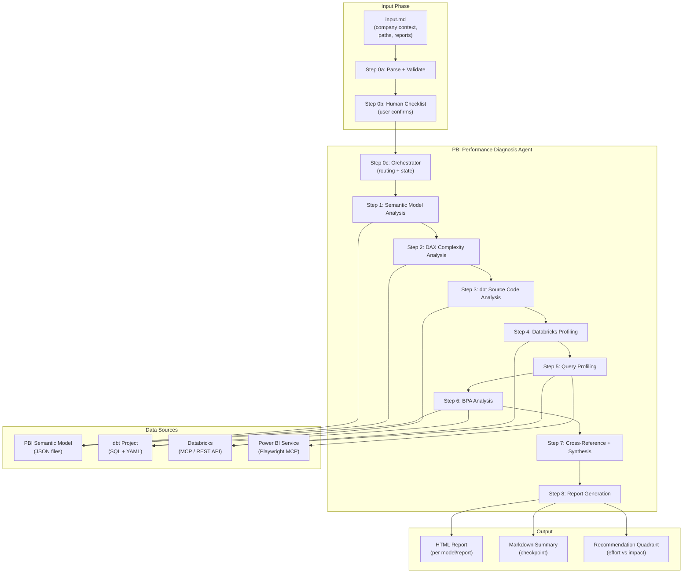

# PBI Performance Diagnosis Agent

## 1. Vision and Architecture

An AI agent that lives in `claude-cowork/PBI-Performance-Diagnosis-Agent/` and is driven by an `input.md` file in the same directory. The agent reads the input, validates it with the user, and then orchestrates multiple analysis steps across Databricks, dbt, and Power BI to produce a comprehensive, human-readable performance diagnosis report with prioritised recommendations.

### Agent Location

```
claude-cowork/PBI-Performance-Diagnosis-Agent/
  SKILL.md                          # Main agent definition (prompt + instructions)
  input.md                          # User-provided context (required)
  scripts/
    analyse_semantic_model.py       # Parse PBI semantic model JSON
    analyse_dbt_lineage.py          # Parse dbt SQL/YAML, build lineage
    analyse_dax_complexity.py       # Score DAX measure complexity
    generate_report.py              # Produce final HTML report
    requirements.txt                # Dependencies
  references/
    report-template.html            # HTML report template
    system-tables-queries.md        # Databricks query reference
    bpa-rules-reference.md          # BPA rules reference
    input-template.md               # Template for input.md (copy to create new projects)
  evals/
    evals.json                      # Eval scenarios
  output/                           # Agent writes all results here
    model-taxonomy.json
    dax-complexity.json
    dbt-lineage.json
    databricks-profile.json
    query-profile.json
    bpa-results.json
    synthesis.json
    performance-diagnosis.md        # Final checkpoint
    *_Performance_Diagnosis.html    # Final HTML report(s)
```

### Architecture Overview



---

## 2. Databricks Connectivity: Options Analysis

The agent needs to query Databricks for table metadata, volumes, query history, and clustering info. Three viable options:

### Option A: Databricks MCP (Recommended)

Databricks now offers managed MCP servers with a `databricks-mcp` Python package. The DBSQL MCP server allows running AI-generated SQL queries against Unity Catalog tables.

- **Setup**: `pip install databricks-mcp`, then `claude mcp add --transport http databricks-server https://<workspace>/api/2.0/mcp/sql`
- **Pros**: Native integration with Claude/Cursor, governed by Unity Catalog permissions, dynamic tool discovery, no custom code needed for SQL queries
- **Cons**: Requires workspace access and OAuth login (`databricks auth login`), limited to SQL (no REST API for cluster/warehouse management)
- **What it can query**: All Unity Catalog system tables (`system.access.audit`, `system.query.history`, `system.information_schema.*`), any user table metadata

### Option B: PAT + Python SDK / REST API

Use a Databricks Personal Access Token with the `databricks-sdk` Python library or direct REST API calls.

- **Setup**: Store PAT as env var, use `databricks-sdk` in Python scripts
- **Pros**: Full API access (SQL + REST), can query system tables AND manage resources, works without MCP infrastructure
- **Cons**: PAT management (rotation, security), requires custom Python scripts, not declarative/tool-based
- **What it can query**: Everything MCP can + REST API endpoints (warehouse info, cluster config, job history)

### Option C: Hybrid (MCP for SQL + PAT for REST)

Use Databricks MCP for SQL queries (table metadata, query history, volumes) and PAT-based Python scripts for REST API calls (warehouse config, Photon status, etc.)

- **Pros**: Best of both worlds
- **Cons**: Two auth mechanisms to manage

**Recommendation**: Start with **Option A (Databricks MCP)** for SQL-based analysis, since the agent primarily needs to run `SELECT` queries against system tables and `DESCRIBE` commands. If REST API access is needed later (e.g. warehouse sizing), add PAT-based scripts incrementally.

### Key Databricks System Tables / Queries

The agent will run these queries via MCP or Python:

```sql
-- Table volume (row count, size)
DESCRIBE DETAIL <catalog>.<schema>.<table>;

-- Table properties (clustering, partitioning)
SHOW TBLPROPERTIES <catalog>.<schema>.<table>;

-- Column statistics
DESCRIBE EXTENDED <catalog>.<schema>.<table>;

-- Query history (frequency, duration)
SELECT * FROM system.query.history
WHERE statement_type = 'SELECT'
  AND start_time >= DATEADD(DAY, -30, CURRENT_TIMESTAMP())
ORDER BY total_duration_ms DESC;

-- Volume breakdown by date
SELECT date_col, COUNT(*) as row_count
FROM <catalog>.<schema>.<fact_table>
GROUP BY date_col
ORDER BY date_col;
```

---

## 3. Input Specification: `input.md`

The agent is driven by a file called `input.md` located in the same directory as `SKILL.md` (`claude-cowork/PBI-Performance-Diagnosis-Agent/input.md`). This file provides all the context the agent needs about the company, environment, and scope of analysis. A template is provided at `references/input-template.md` for reuse in other projects.

### `input.md` Structure

The file uses markdown with structured sections. Each section has **required** and **optional** fields:

```markdown
# PBI Performance Diagnosis - Input

## Company Context
- **Company/Project Name**: ASOS ADE
- **Business Domain**: Retail / E-commerce
- **Brief Description**: Analytics Data Ecosystem for ASOS, serving dashboards for sales,
  supply chain, customer, and product domains.

## Reports to Analyse
<!-- List the specific reports with performance issues. Leave empty for Full mode. -->
- ADE - OrderLine (critical - slowest report, 6B+ rows in fact table)
- ADE - Sales (slow page loads on billed sale visuals)
- ADE - Trade (daily trade snapshot slow on peak hours)

## Semantic Model Repository
<!-- Path to the Power BI semantic model source code (Tabular Editor / PBIR format) -->
- **Path**: /Users/brunogcmartins/environment/cit/ASOS/asos-data-workflow/asos-data-ade-powerbi
- **Models directory**: powerbi/models
- **BPA rules path**: powerbi/bestpracticeanalyser/BPARules.json

## dbt Repository
<!-- Path to the dbt project. Leave empty if not available. -->
- **Path**: /Users/brunogcmartins/environment/cit/ASOS/asos-data-workflow/asos-data-ade-dbt
- **Serve layer pattern**: bundles/core_data/models/<domain>/serve/
- **Contracts pattern**: bundles/core_data/models/<domain>/serve/_contracts/
- **manifest.json path**: (not committed - run `dbt compile` to generate, or check `.dbt_manifest/`)

## Databricks Connection
<!-- How the agent should connect to Databricks. Fill one option. -->
- **Connection method**: MCP | PAT | Skip
- **Workspace URL**: https://adb-xxxx.azuredatabricks.net
- **SQL Warehouse HTTP Path**: /sql/1.0/warehouses/xxxx
- **PAT (if using PAT method)**: (set as env var DATABRICKS_TOKEN, do NOT paste here)
- **Catalogs to analyse**: sales, product, customer, supplychain, sourcingandbuying

## Power BI Report URLs
<!-- Optional: URLs for Playwright MCP browser analysis. User will authenticate manually. -->
- https://app.powerbi.com/groups/xxx/reports/yyy (ADE - OrderLine report)
- https://app.powerbi.com/groups/xxx/reports/zzz (ADE - Sales report)

## Additional Context
<!-- Any extra information that may help the agent's analysis -->
- The main fact table `fact_order_line_v1` has over 6 billion rows
- Most reports use DirectQuery against Databricks SQL Warehouse
- The serve layer in dbt is entirely views over curated Delta tables
- Liquid clustering is used on curated tables
- Power BI Premium capacity is available
```

### Fields Classification

**Required fields** (agent will not proceed without):
- Company/Project Name
- At least one of: Semantic Model Repository path OR Databricks Connection OR Report URLs
- Reports to Analyse (or explicitly state "Full" for complete analysis)

**Optional fields** (agent proceeds with graceful degradation):
- dbt Repository path (if absent, Steps 3 skipped)
- Databricks Connection (if absent, Steps 4-5 partially skipped)
- Power BI Report URLs (if absent, browser-based analysis skipped)
- BPA rules path (defaults to `powerbi/bestpracticeanalyser/BPARules.json`)
- Additional Context (free-form, always helpful)

### Step 0a: Input Validation Flow

When the agent starts, it executes this validation sequence:

1. **Read** `input.md` from the agent directory
2. **Parse** each section, extracting values into structured internal state
3. **Validate** required fields are present and paths exist on disk (using filesystem tools)
4. **Classify** available data sources (what analysis steps are possible)
5. **Present a checklist** to the user summarising what was understood:

```
I have read your input.md. Here is what I understood:

CONTEXT
  - Project: ASOS ADE (Retail / E-commerce)
  - Mode: Targeted analysis (3 reports)

REPORTS TO ANALYSE
  [x] ADE - OrderLine (found at powerbi/models/sales/ADE - OrderLine/)
  [x] ADE - Sales (found at powerbi/models/sales/ADE - Sales/)
  [x] ADE - Trade (found at powerbi/models/sales/ADE - Trade/)

DATA SOURCES
  [x] Semantic Model repo: /path/to/asos-data-ade-powerbi (verified, 13 models found)
  [x] BPA rules: powerbi/bestpracticeanalyser/BPARules.json (verified, 42 rules)
  [x] dbt repo: /path/to/asos-data-ade-dbt (verified, 144 serve models found)
  [ ] Databricks MCP: Not configured — Steps 4-5 will have limited data
  [ ] Report URLs: 2 URLs provided — will use Playwright MCP (you will need to authenticate)

ANALYSIS PLAN
  Step 1: Semantic Model Analysis ............. ENABLED (3 models)
  Step 2: DAX Complexity Analysis ............. ENABLED
  Step 3: dbt Source Code Analysis ............ ENABLED
  Step 4: Databricks Metadata Profiling ....... SKIPPED (no Databricks connection)
  Step 5: Query Profiling ..................... PARTIAL (browser only, no query history)
  Step 6: Best Practice Analyser .............. ENABLED
  Step 7: Cross-Reference + Synthesis ......... ENABLED (with available data)
  Step 8: Report Generation ................... ENABLED

MISSING INFORMATION
  - Databricks connection not configured. Would you like to:
    (a) Set up Databricks MCP now
    (b) Provide a PAT token
    (c) Skip Databricks analysis

Is this correct? Shall I proceed with this analysis plan?
```

6. **Wait for user confirmation** before proceeding
7. If the user provides corrections or additional info, **update internal state** and re-present the checklist
8. Only after explicit user approval does the agent move to Step 1

### When `input.md` is Missing or Empty

If the file does not exist or is empty, the agent:
1. Informs the user that `input.md` is required
2. Copies `references/input-template.md` to `input.md` as a starting point
3. Asks the user to fill in the required sections
4. Waits for the user to confirm the file is ready
5. Re-reads and validates

---

## 4. Agent Skill Definition

The agent lives in [`claude-cowork/PBI-Performance-Diagnosis-Agent/`](claude-cowork/) as a standalone, reusable skill. It follows the patterns established by [`pbi-performance`](asos-agentic-workflow/web-app/skills/custom/pbi-performance/SKILL.md) and [`dax-analyst`](asos-agentic-workflow/web-app/skills/custom/dax-analyst/SKILL.md) but is self-contained and does not depend on the `asos-agentic-workflow` web app to run.

### How to run

The agent can be invoked in multiple ways:
- **Cursor**: Open the agent directory, the SKILL.md acts as a prompt/instruction set
- **Claude Code CLI**: `claude --skill claude-cowork/PBI-Performance-Diagnosis-Agent/SKILL.md`
- **asos-agentic-workflow** (optional integration): Register in `agent.ts` if desired

### Optional integration with asos-agentic-workflow

If the team wants to integrate with the existing web app, add an entry to [`web-app/shared/src/types/agent.ts`](asos-agentic-workflow/web-app/shared/src/types/agent.ts) `AGENT_DEFINITIONS`:

```typescript
{
  id: 'pbi-perf-diagnosis',
  name: 'PBI Performance Diagnosis Agent',
  description: '...',
  role: 'Performance Diagnosis Analyst',
  category: 'Engineering',
  command: 'pbi-perf-diagnosis',
  checkpointFile: 'performance-diagnosis.md',
  requiresInput: true,
  inputPlaceholder: 'Ensure input.md is filled in the agent directory',
  outputDir: '08-performance-diagnosis',
  defaultContext: {
    dataSources: ['input.md', 'powerbi-repo', 'dbt-repo', 'databricks'],
    tools: ['filesystem', 'python', 'playwright'],
    mcpServers: ['databricks-mcp'],
    dependsOn: [],
  },
  lifecycle: 'dev',
}
```

---

## 4. Agent Workflow: Step-by-Step

### Step 0: Input Validation + Orchestrator

This step is split into three sub-steps (see Section 3 for full detail on `input.md`):

**Step 0a: Parse input.md**
- Read `claude-cowork/PBI-Performance-Diagnosis-Agent/input.md`
- Extract all structured fields (company context, paths, reports, connections)
- Validate that required fields are present
- Verify that filesystem paths exist and contain expected content (e.g. `powerbi/models/` has model directories, dbt project has `dbt_project.yml`)
- Check Databricks connectivity (MCP available? PAT set in env?)
- If `input.md` is missing/empty: copy template, ask user to fill it, wait

**Step 0b: Human validation checklist**
- Present a structured checklist to the user showing everything the agent understood
- Show which analysis steps will be ENABLED, PARTIAL, or SKIPPED based on available data sources
- Highlight any MISSING INFORMATION with options for the user
- **Wait for explicit user confirmation** before proceeding
- If user corrects anything, re-parse and re-present

**Step 0c: Orchestrator routing**
- Based on confirmed input, determine which steps to execute and in what order
- Initialise the `output/` directory for intermediate state files
- Begin execution from Step 1

### Step 1: Semantic Model Analysis

**Source**: PBI semantic model JSON files in [`asos-data-ade-powerbi/powerbi/models/`](asos-data-ade-powerbi/powerbi/models/)

**What it does**:
- Parse each model's `database.json` for model metadata and BPA config
- Parse `expressions/*.json` to understand data source functions (`_fn_GetDataFromDBX`, parameters)
- Parse `tables/*/partitions/*.json` to classify each table's storage mode (`import` / `directQuery` / `dual`)
- Parse `relationships/*.json` to build a relationship graph (from/to tables, active/inactive, cardinality, cross-filter direction)
- Parse `tables/*/<TableName>.json` for extended properties (source catalog, schema, table)
- Count tables, columns, measures, relationships per model

**Output (internal state)**:
- Model taxonomy: table inventory with storage modes, source Databricks tables, column counts
- Relationship graph: which tables connect, many-to-many, bidirectional, inactive
- Source mapping: PBI table name -> Databricks catalog.schema.table

### Step 2: DAX Complexity Analysis

**Source**: PBI semantic model `tables/@Measures/measures/*.json` and measure definitions in other tables

**What it does**:
- Parse all measure DAX expressions across the model
- Score complexity: simple aggregation (SUM/COUNT) = low; CALCULATE with filters = medium; nested iterators (SUMX with FILTER) = high; time intelligence chains = medium-high
- Identify which tables each measure references (dependency graph)
- Flag anti-patterns: FILTER(ALL), IFERROR, missing VAR, bare division, nested CALCULATE
- Map measures to tables: which DirectQuery tables does each measure touch?
- Identify measures that cross multiple DQ tables (expensive cross-source joins)

**Output (internal state)**:
- Measure complexity scores (ranked)
- Measure-to-table dependency map
- Anti-pattern inventory
- "Hot tables" list: tables referenced by the most/heaviest measures

### Step 3: dbt Source Code Analysis

**Source**: dbt project in [`asos-data-ade-dbt/`](asos-data-ade-dbt/) (when available)

**What it does**:
- Parse `dbt_project.yml` for domain/layer/materialization config
- Parse serve-layer SQL files (`bundles/core_data/models/<domain>/serve/*.sql`) to understand:
  - Which curated tables each serve view references (`ref()` calls)
  - Whether the view applies filters, unions, or is a simple passthrough
  - Column projection (is the view selecting all columns or a subset?)
- Parse `_contracts/*.yml` for materialization strategy, clustering config, incremental strategy
- Parse curated-layer contracts for `liquid_clustered_by`, `incremental_strategy`, `unique_key`
- If `manifest.json` is available (from `.dbt_manifest/` or `target/`), use it for compiled SQL and full DAG
- Check BPA-bouncer rules in `dbt-bouncer.yml`

**Output (internal state)**:
- Serve-to-curated lineage map
- Materialization inventory: which serve objects are views vs tables vs materialized views
- Clustering/partitioning report per curated table
- SQL complexity assessment for serve views (UNIONs, complex JOINs, wide SELECTs)
- Recommendations for materialization changes

### Step 4: Databricks Metadata Profiling

**Source**: Databricks via MCP or Python SDK (when available)

**What it does** (for each Databricks table referenced by PBI models):
- `DESCRIBE DETAIL` for row count, file count, size in bytes
- `SHOW TBLPROPERTIES` for liquid clustering columns, auto-optimize settings
- Volume breakdown: `SELECT date_column, COUNT(*)` grouped by day/week/month/year
- Check if table is a view or a Delta table (`DESCRIBE EXTENDED`)
- Check serve-layer: since serve objects are views, trace to the underlying curated table for physical stats

**Output (internal state)**:
- Table profile: row count, size, file count, clustering columns, partition columns
- Volume distribution: daily/weekly/monthly/yearly breakdown
- View vs table classification
- "Data hotspots": tables with extreme volumes (billions of rows)

### Step 5: Query Profiling

**Source**: Databricks `system.query.history` + optionally Power BI Performance Analyzer (via Playwright MCP)

**What it does**:
- Query Databricks `system.query.history` for the last 30 days, filtered by:
  - Queries from Power BI (user agent or service principal)
  - Queries touching the serve schema tables identified in Step 1
- Rank queries by: total duration (p50, p95, p99), frequency, rows scanned
- Identify "query shape patterns": which tables are always joined, which filters are applied
- Cross-reference with PBI visuals: which report pages/visuals generate the slowest queries
- If Playwright MCP is available and user provides a report URL:
  - Open the report (user authenticates)
  - Capture Performance Analyzer data
  - Parse visual-level timing breakdown
  - Identify slowest visuals and their corresponding DAX queries

**Output (internal state)**:
- Top N slowest queries (with SQL text if available)
- Query frequency distribution
- Query-to-PBI-table mapping
- Visual-level performance breakdown (if browser data available)

### Step 6: Best Practice Analyser (BPA)

**Source**: PBI semantic model + dbt code + community best practices

**What it does**:
- Run BPA rules from [`BPARules.json`](asos-data-ade-powerbi/powerbi/bestpracticeanalyser/BPARules.json) against the semantic model
- Use the existing `run_bpa.py` script from `pbi-performance` skill
- Additionally check for:
  - DirectQuery without aggregations (already a rule: `MODEL_USING_DIRECT_QUERY_AND_NO_AGGREGATIONS`)
  - Dual mode tables that could be import
  - Bidirectional cross-filtering on DQ tables
  - Many-to-many relationships
  - Wide tables (>50 columns) in DirectQuery
  - Missing format strings on measures
  - Auto date/time tables enabled
- dbt-side BPA:
  - Check `dbt-bouncer.yml` rules
  - Validate serve views are not unnecessarily wide (selecting all columns when PBI only uses a subset)
  - Check for missing clustering on high-volume curated tables
- Community best practices (agent knowledge):
  - Microsoft's DirectQuery performance guidelines
  - Databricks connector best practices
  - VertiPaq vs DirectQuery trade-off guidance

**Output (internal state)**:
- BPA findings with severity (High/Medium/Low)
- Per-object rule compliance
- dbt-level findings
- Community best practice gaps

### Step 7: Cross-Reference and Synthesis

This is the core intelligence step where findings from all previous steps are combined.

**What it does**:
- For each fact table in DirectQuery:
  - Combine: PBI storage mode + Databricks row count + query frequency/duration + DAX measures that reference it + dbt materialization + BPA findings
  - Determine root cause(s) of performance issues
- Build a "criticality score" per finding:
  - **Impact**: How much would fixing this improve performance? (based on query duration, frequency, volume)
  - **Effort**: How much work to implement? (code change vs infrastructure change vs architecture change)
  - **Risk**: What could go wrong? (data freshness, breaking changes, regression)
- Build recommendation quadrant (effort vs impact 2x2 matrix):
  - Quick Wins (low effort, high impact)
  - Strategic Investments (high effort, high impact)
  - Minor Improvements (low effort, low impact)
  - Avoid / Deprioritise (high effort, low impact)
- Generate trade-off explanations for each recommendation

**Synthesis categories**:
1. Storage mode optimisation (DQ to dual/import, hybrid incremental refresh)
2. Databricks-side tuning (clustering, materialized views, warehouse config)
3. dbt-layer changes (materialize serve views, add aggregation tables, reduce column projection)
4. DAX optimisation (anti-patterns, measure refactoring)
5. Model architecture (reduce relationships, split models, add aggregation tables)
6. Report design (reduce visuals per page, optimise filter placement)

### Step 8: Report Generation

**Output**: A comprehensive HTML report (per model or per report) + markdown summary.

**Report structure**:

1. **Executive Summary** -- Key findings, overall health score, top 3 recommendations (non-technical language)
2. **Model Taxonomy** -- Table inventory, storage modes, relationship diagram (Mermaid), data source mapping
3. **Data Volume Profile** -- Table sizes, row counts, volume distribution charts, growth trends
4. **Storage Mode Analysis** -- What is DirectQuery/Dual/Import, why it matters, current state per table
5. **DAX Complexity Report** -- Measure complexity ranking, anti-pattern inventory, hot tables
6. **Query Performance Profile** -- Slowest queries, frequency distribution, query-to-visual mapping
7. **Best Practice Findings** -- BPA results table with severity badges, dbt findings, community gaps
8. **Root Cause Analysis** -- Per-issue deep dive with evidence from multiple layers
9. **Recommendation Quadrant** -- Visual 2x2 matrix (effort vs impact) with all recommendations plotted
10. **Detailed Recommendations** -- Each recommendation with: description, impact, effort, risk, trade-offs, implementation steps
11. **Implementation Roadmap** -- Prioritised timeline with dependencies
12. **Appendices** -- Raw data tables, full BPA results, query samples

**Non-technical language**: All explanations use analogies and plain language. Technical details in collapsible sections or appendices. British English throughout.

---

## 5. Reusability Design

The agent must work across different projects with the same stack (Databricks + Power BI). Key design decisions:

### Graceful degradation

The agent works with whatever data sources are available:

| Available | Analysis capability |
|-----------|-------------------|
| PBI semantic model repo | Full: model taxonomy, DAX complexity, BPA, relationships |
| PBI repo + dbt repo | Full + lineage from PBI to dbt to Databricks, materialization analysis |
| PBI repo + Databricks MCP | Full + volume profiling, query history |
| PBI repo + dbt + Databricks | Complete analysis (all steps) |
| Only Databricks MCP | Limited: volume profiling, query history, table metadata only |
| Only report URL (Playwright) | Limited: Performance Analyzer capture, visual-level timing |

### Configuration via `input.md`

All project-specific configuration lives in `input.md` (see Section 3). To reuse the agent in a new project:

1. Copy the entire `PBI-Performance-Diagnosis-Agent/` directory to the new project
2. Copy `references/input-template.md` to `input.md`
3. Fill in the company context, paths, and reports
4. Run the agent -- it will validate and present the checklist before starting

No hardcoded paths or project-specific assumptions exist in `SKILL.md` or the scripts. Everything is parameterised through `input.md`.

### Parameterisation (all via `input.md`)

- **Semantic model path**: absolute or relative path to the PBI repo with models
- **dbt path**: absolute or relative path to the dbt project (optional)
- **Databricks connection**: MCP URL, PAT, or "Skip" (optional)
- **Report URLs**: Power BI Service URLs for browser analysis (optional)
- **BPA rules path**: defaults to `powerbi/bestpracticeanalyser/BPARules.json` but overridable in input.md
- **Report language**: defaults to British English
- **Analysis scope**: list of reports/models or "Full"
- **Catalogs**: which Databricks catalogs to analyse

---

## 6. Tools, MCPs, and Memory

### Tools the agent uses

| Tool | Purpose |
|------|---------|
| Filesystem (Read/Write/Glob/Grep) | Parse PBI JSON, dbt SQL/YAML, write reports |
| Python scripts | Structured parsing, complexity scoring, report generation |
| Playwright MCP | Open PBI reports in browser, capture Performance Analyzer data |
| Databricks MCP (DBSQL) | Query system tables, table metadata, query history |
| Flow MicroStrategy MCP (existing) | Optional: cross-reference with MicroStrategy lineage in Neo4j |

### Memory / State

The agent maintains intermediate state between steps using JSON files in `claude-cowork/PBI-Performance-Diagnosis-Agent/output/`:

- `input-validated.json` -- parsed and confirmed input from Step 0
- `model-taxonomy.json` -- output of Step 1
- `dax-complexity.json` -- output of Step 2
- `dbt-lineage.json` -- output of Step 3
- `databricks-profile.json` -- output of Step 4
- `query-profile.json` -- output of Step 5
- `bpa-results.json` -- output of Step 6
- `synthesis.json` -- output of Step 7
- `performance-diagnosis.md` -- final checkpoint
- `*_Performance_Diagnosis.html` -- final HTML report(s)

### Human interaction points

The agent asks the user when:
- Databricks MCP is not configured: "How would you like to connect to Databricks?"
- Report URL is needed for Playwright analysis: "Please provide the Power BI report URL"
- Authentication is needed: "Please authenticate in the browser window"
- Ambiguous scope: "I found 13 semantic models. Which would you like to analyse?"
- Missing context: "I cannot determine which date column to use for volume breakdown. Which column represents the transaction date?"

---

## 7. Implementation Phases

### Phase 1: Core Skill (Steps 1, 2, 6, 8)

Build the skill that analyses PBI semantic models without external dependencies:
- Parse semantic model JSON (tables, relationships, measures, partitions, expressions)
- Score DAX complexity and detect anti-patterns
- Run BPA rules
- Generate HTML report with model taxonomy + DAX findings + BPA results
- Leverage existing `pbi-performance` and `dax-analyst` scripts where possible

### Phase 2: dbt Integration (Step 3)

Add dbt source code analysis:
- Parse serve SQL and contracts YAML
- Build lineage from PBI tables to dbt models to Databricks tables
- Add materialization recommendations to the report

### Phase 3: Databricks Integration (Steps 4, 5)

Add Databricks metadata and query profiling:
- Configure Databricks MCP or PAT-based scripts
- Query system tables for volume and query history
- Add volume profile and query performance sections to the report

### Phase 4: Browser Integration (Step 5 enhancement)

Add Playwright MCP for live report analysis:
- Capture Performance Analyzer data from running reports
- Cross-reference visual-level timing with DAX measures and DQ tables

### Phase 5: Cross-Reference and Quadrant (Step 7)

Build the synthesis engine:
- Combine all findings into criticality-scored recommendations
- Generate the effort/impact quadrant
- Produce trade-off explanations in non-technical language
